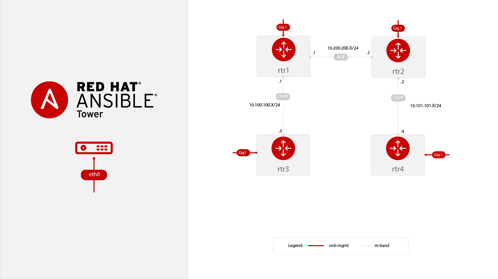
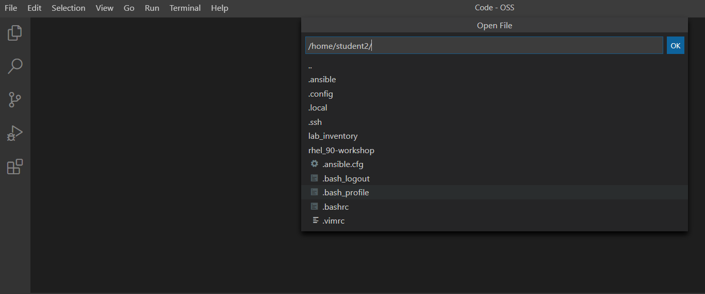
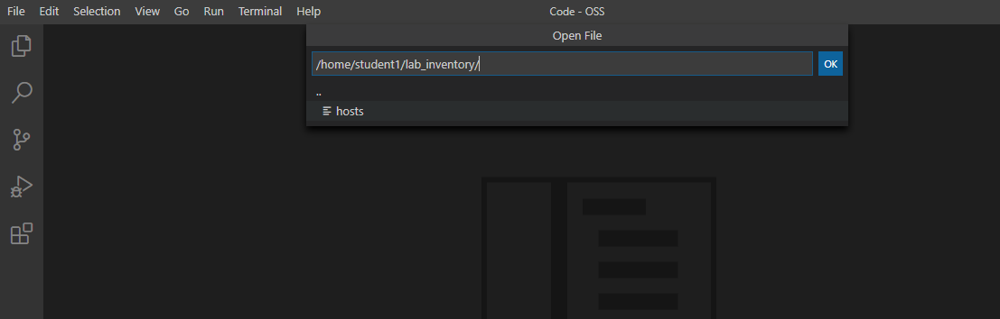

# Exercise 1.1 - Exploring the lab environment

**Read this in other languages**:  [English](README.md),   [日本語](README.ja.md).

## Table of Contents

- [Objective](#objective)
- [Diagram](#diagram)
- [Guide](#guide)
- [Takeaways](#takeaways)

# Objective

Explore and understand the lab environment.  This exercise will cover
- Determining the Ansible version running on the control node
- Locating and understanding the Ansible configuration file (`ansible.cfg`)
- Locating and understanding an `ini` formatted inventory file

# Diagram



There are four routers, named rtr1, rtr2, rtr3 and rtr4.  This diagram is always available on the [network automation workshop table of contents](../README.md).  The SSH configuration file (~/.ssh/config) is already setup so you can easily SSH to any router from the control node.

# Guide

## Step 1

All automation is done from the Ansible control host, a Red Hat Enterprise Linux machine. To make access to the control host and managing files on it easier, there is a online version of VS Code editor installed directly on the control host. This way, it can be accessed via a normal web browser. Commands can be executed right from the terminal within the VS Code editor.

Let's access the Visual Studio Code. Click on the link for VS Code access from the workshop page:


At this point, you will see a **Welcome** page:


From within this environment, you can create and modify files or open a terminal and execute commands.

## Step 2 - Opening up Bash Terminal

So let's open a new terminal in VS Code. In the menu bar, click on **Terminal** > **New Terminal**. 


A new terminal will be opened in the lower part of your editor and you will be at the command prompt. Note that most prerequisite tasks have already been done for you:

  - Ansible software is installed

  - SSH connection and keys are configured

  - `sudo` has been configured on the managed hosts to run commands that require root privileges.

Note that each student is assigned a student number, i.e. X and you should work as that student <X> user on the control node if not explicitly told differently.

Next, proceed to check that Ansible has been installed correctly.

```bash
    [student1@ansible ~]$ cd ~/network-workshop/
    [student1@ansible network-workshop]$
    [student1@ansible network-workshop]$ pwd
    /home/student1/network-workshop
```
 - `~` - the tilde in this context is a shortcut for `/home/student1`
 - `cd` - Linux command to change directory
 - `pwd` - Linux command for print working directory.  This will show the full path to the current working directory.

Additionally we can check the Ansible version running on the server by running the following command. 

Run the `ansible` command with the `--version` command to look at what is configured:
```
[student1@ansible ~]$ ansible --version
ansible 2.9.8
  config file = /home/student1/.ansible.cfg
  configured module search path = [u'/home/student1/.ansible/plugins/modules', u'/usr/share/ansible/plugins/modules']
  ansible python module location = /usr/lib/python2.7/site-packages/ansible
  executable location = /usr/bin/ansible
  python version = 2.7.5 (default, Jun 11 2019, 12:19:05) [GCC 4.8.5 20150623 (Red Hat 4.8.5-36)]
```
The result should resemble the following:


**NOTE** 

The version you see might be different

This command gives you information about the version of Ansible, location of the executable, version of Python, search path for the modules and location of the `ansible configuration file`.

## Step 3

In the lab environment provided to you an `.ansible.cfg` file has already been created and filled with the necessary details in the home directory of your `student<X>` user on the control node:

The view the file, click on the **File** menu button on the top left-hand corner of your Visual Studio Code. And select **Open File**:
 

From the drop-down menu select `.ansible.cfg` which will display your ansible configuration file.

There are multiple configuration flags provided, but make sure to note the last line: where the location of the inventory is provided.

## Step 4

The scope of a `play` within a `playbook` is limited to the groups of hosts declared within an Ansible **inventory**. Ansible supports multiple [inventory](http://docs.ansible.com/ansible/latest/intro_inventory.html) types. An inventory could be a simple flat file with a collection of hosts defined within it or it could be a dynamic script (potentially querying a CMDB backend) that generates a list of devices to run the playbook against.

In this lab you will work with a file based inventory written in the **ini** format. Open the inventory file through VS Code Editor to view the contents of your inventory:


## Step 5

In the above output every `[ ]` defines a group. For example `[dc1]` is a group that contains the hosts `rtr1` and `rtr3`. Groups can also be _nested_. The group `[routers]` is a parent group to the group `[cisco]`

> Parent groups are declared using the `children` directive. Having nested groups allows the flexibility of assigining more specific values to variables.


> Note: A group called **all** always exists and contains all groups and hosts defined within an inventory.


We can associate variables to groups and hosts.

Host variables can be defined on the same line as the host themselves. For example for the host `rtr1`:

```
rtr1 ansible_host=18.222.121.247 private_ip=172.16.129.86
```

 - `rtr1` - The name that Ansible will use.  This can but does not have to rely on DNS
 - `ansible_host` - The IP address that ansible will use, if not configured it will default to DNS
 - `private_ip` - This value is not reserved by ansible so it will default to a [host variable](http://docs.ansible.com/ansible/latest/intro_inventory.html#host-variables).  This variable can be used by playbooks or ignored completely.

Group variables groups are declared using the `vars` directive. Having groups allows the flexibility of assigning common variables to multiple hosts. Multiple group variables can be defined under the `[group_name:vars]` section. For example look at the group `cisco`:

```
[cisco:vars]
ansible_user=ec2-user
ansible_network_os=ios
ansible_connection=network_cli
```

 - `ansible_user` - The user ansible will be used to login to this host, if not configured it will default to the user the playbook is run from
 - `ansible_network_os` - This variable is necessary while using the `network_cli` connection type within a play definition, as we will see shortly.
 - `ansible_connection` - This variable sets the [connection plugin](https://docs.ansible.com/ansible/latest/plugins/connection.html) for this group.  This can be set to values such as `netconf`, `httpapi` and `network_cli` depending on what this particular network platform supports.


# Complete


----
**Navigation**
<br>
[Next Exercise](../1.2-first-playbook)

---
[Click Here to return to the Ansible Network Automation Workshop](../README.md)
