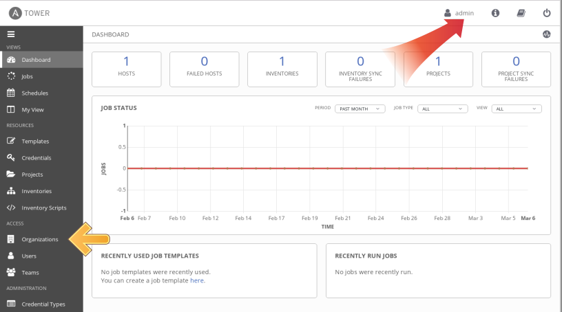
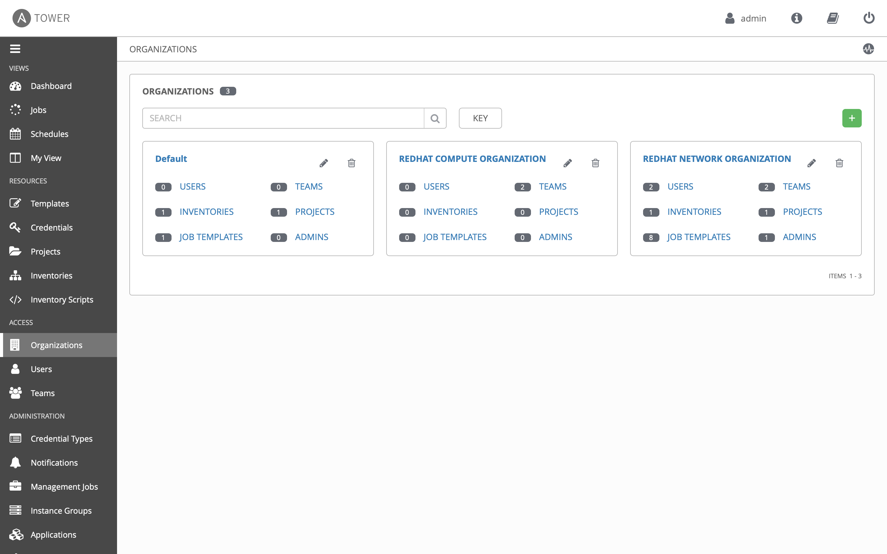
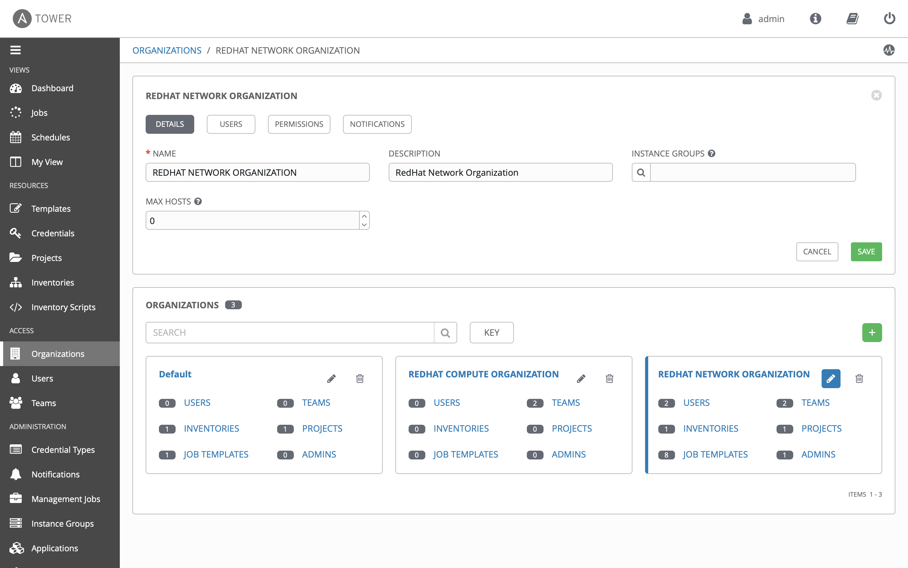
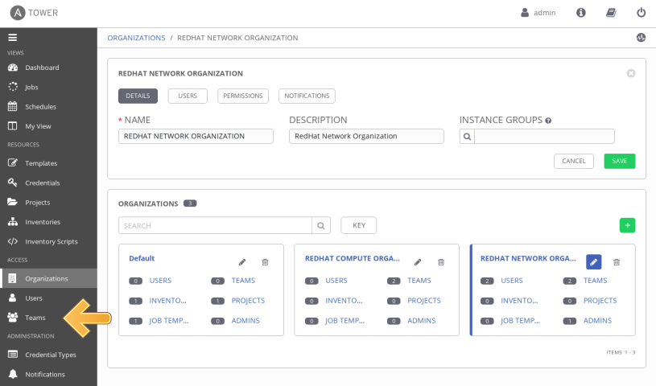
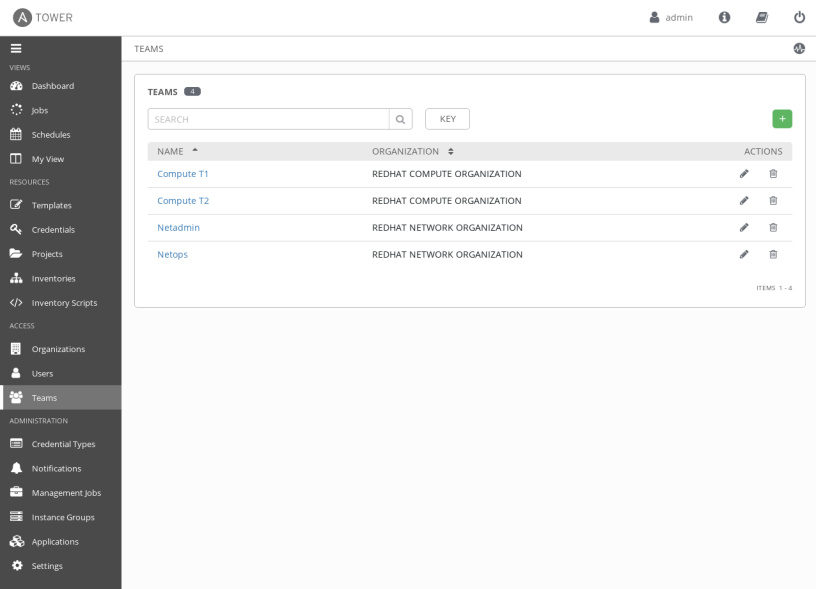

# Exercise 2.4: Understanding RBAC in Ansible Tower

**Read this in other languages**:  [English](README.md),   [日本語](README.ja.md).

## Table of Contents

# Objective

One of the key benefits of using Ansible Tower is the control of users that use the system. The objective of this exercise is to understand Role Based Access Controls([RBACs](https://docs.ansible.com/ansible-tower/latest/html/userguide/security.html#role-based-access-controls)) with which Tower admins can define tenancies, teams, roles and associate users to those roles. This gives organizations the ability to secure the automation system and satisfy compliance goals and requirements.

# Guide

Lets review some Ansible Tower terminology:

- **Organizations:** Defines a tenancy for example *Network-org*, *Compute-org*. This might be reflective of internal organizational structure of the customer's organization.
- **Teams:** Within each organization, there may be more than one team. For instance *tier1-helpdesk*, *tier2-support*, *tier3-support*, *build-team* etc.
- **Users:** Users typically belong to teams. What the user can do within Tower is controlled/defined using **roles**
- **Roles:** Roles define what actions a user may perform. This can map very nicely to typical network organizations that have restricted access based on whether the user is a Level-1 helpdesk person, Level-2 or senior admin. Tower [documentation ](https://docs.ansible.com/ansible-tower/latest/html/userguide/security.html#built-in-roles)defines a set of built-in roles.

For more in depth details on RBAC terminology please refer to the [documentation](https://docs.ansible.com/ansible-tower/latest/html/userguide/security.html#role-based-access-controls)

## Step 1: Opening up Organizations

1. Login to Ansible Tower with the **admin** user.

2. Confirm that you are logged in as the **admin** user.

   

3. Under the **ACCESS** section, click on **Organizations**

   As the *admin* user, you will be able to view all organizations configured for Ansible Tower:

   >Note: The orgs, teams and users were auto-populated for this workshop

4. Examine the organizations

   There are 2 organizations (other than Default):

   1. **RED HAT COMPUTE ORGANIZATION**
   2. **RED HAT NETWORK ORGANIZATION**

   

   >Observe that this page gives you a summary of all the teams, users, inventories, projects and job templates associated with it. If a Organization level admin is configure you will see that as well.

## Step 2: Open the NETWORK ORGANIZATION

1. Click on the **RED HAT NETWORK ORGANIZATION**.

   This brings up a section that displays the details of the organization.

   

2. Click on the **USERS** button to see users associated with this organization.

   >Observe that both the **network-admin** and **network-operator** users are associated with this organization.

## Step 3: Examine Teams

1. Click on **TEAMS** in the sidebar

   

2. Examine the teams.  The Ansible Tower admin  will be able to see all available teams.  There are four teams:

     1. Compute T1
     2. Compute T2
     3. Netadmin
     4. Netops   

   

## Step 4: Create Tower User

There are three types of Tower Users:

- **Normal User**: Have read and write access limited to the inventory and projects for which that user has been granted the appropriate roles and privileges.

- **System Auditor**: Auditors implicitly inherit the read-only capability for all objects within the Tower environment.

- **System Administrator**: Has admin, read, and write privileges over the entire Tower installation.

Let’s create a user:

- In the Tower menu under **ACCESS** click **Users**

- Click the green plus button

- Fill in the values for the new user:

<table>
  <tr>
    <th>Parameter</th>
    <th>Value</th>
  </tr>
  <tr>
    <td>FIRST NAME </td>
    <td>test</td>
  </tr>
  <tr>
    <td>LAST NAME</td>
    <td>user</td>
  </tr>
  <tr>
    <td>Organization</td>
    <td>RED HAT NETWORK ORGANIZATION</td>
  </tr>         
  <tr>
    <td>EMAIL</td>
    <td>tuser@example.com</td>
  </tr>
  <tr>
    <td>USERNAME</td>
    <td>tuser</td>
  </tr>  
  <tr>
    <td>PASSWORD</td>
    <td>ansible</td>
  </tr>
  <tr>
    <td>CONFIRM PASSWORD</td>
    <td>ansible</td>
  </tr>
  <tr>
    <td>USER TYPE</td>
    <td>Normal User</td>
  </tr>                           
</table>

- Click **SAVE**

## Step 5: Ansible Tower Teams

Teams provide a means to implement role-based access control schemes and delegate responsibilities across organizations. For instance, permissions may be granted to a whole Team rather than each user on the Team.

Create a Team:

- In the menu go to **ACCESS → Teams**

- Click the green plus button and create a team named `Execution Team`.

- Select the RED HAT NETWORK ORGANIZATION` for the team Organization

- Click **SAVE**

Now you can add a user to the Team:

- Switch to the Users view of the `tuser` Team by clicking the **USERS** button.

- Click the green plus button, tick the box next to the `tuser` user and click **SAVE**.

Now click the **PERMISSIONS** button in the **TEAMS** view, you will be greeted with "No Permissions Have Been Granted".

## Step 6: Granting Permissions

To allow users or teams to actually do something, you have to set permissions. The Team `Execution Team` should only be allowed to modify content of the assigned webservers.

Add the permission to use the template:

- In the Permissions view of the Team `Execution Team` click the green plus button to add permissions.

- A new window opens. You can choose to set permissions for a number of resources.

    - Select the resource type **JOB TEMPLATES**

    - Choose the `Network-Banner` Template by ticking the box next to it.

- The second part of the window opens, here you assign roles to the selected resource.

    - Choose **EXECUTE**

- Click **SAVE**

## Step 7: Test Permissions

Now log out of Tower’s web UI and in again as the **tuser** user.

- Go to the **Templates** view, you should notice for wweb only the `Network-Banner` template is listed. He is allowed to view and launch, but not to edit the Template. Just open the template and try to change it.

- Run the Job Template by clicking the rocket icon. Enter the survey content to your liking and launch the job.

- In the following **Jobs** view have a good look around, note that there where changes to the host (of course…​).

# Takeaways

 - Using Ansible Tower's powerful RBAC feature, you can see it is easy to restrict access to operators to run prescribed commands on production systems without requiring them to have access to the systems themselves.
 - Ansible Tower can support multiple Organizations, multiple Teams and users.  Users can even belong to multiple Teams and Organizations if needed.  Something not covered in this exercise is that we do not need to manage users in Ansible Tower, we can use [enterprise authentication](https://docs.ansible.com/ansible-tower/latest/html/administration/ent_auth.html) including Active Directory, LDAP, RADIUS, SAML and TACACS+.
 - If there needs to be an exception (a user needs access but not his entire team) this is also possible.  The granularity of RBAC can be down to the credential, inventory or Job Template for an individual user.

---

# Complete

----
**Navigation**
 
[Previous Exercise](../2.3-tower-job-template) - [Next Exercise](../2.5-tower-workflow)

[Click here to return to the Ansible Network Automation Workshop](../README.md)
