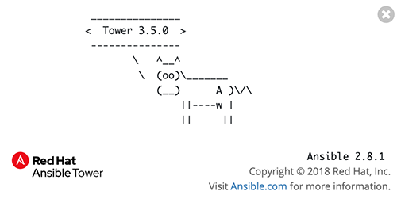

# Exercise 5: Explore Red Hat Ansible Tower

**Read this in other languages**:  [English](README.md),   [日本語](README.ja.md).

## Table of Contents

- [Objective](#objective)
- [Guide](#guide)
   - [Step 1: Login to Ansible Tower](#step-1-login-to-ansible-tower)
   - [Step 2: Examine the Ansible Tower Inventory](#step-2-examine-the-ansible-tower-inventory)
   - [Step 3: Examine the Ansible Tower Workshop Project](#step-3-examine-the-ansible-tower-workshop-project)
   - [Step 4: Examine the Ansible Tower Workshop Credential](#step-4-examine-the-ansible-tower-workshop-credential)
- [Takeaways](#takeaways)

# Objective

Explore and understand the lab environment.  This exercise will cover
- Determining the Ansible version running on the control node
- Locating and understanding:
  - Ansible Tower **Inventory**
  - Ansible Tower **Credentials**
  - Ansible Tower **Projects**

# Guide

## Step 1: Login to Ansible Tower

>This login information has been provided in the Lab login instructions under `Ansible Tower access` section at the beginning of class.

- The username will be `admin`
- password provided in connection information for the lab

After logging in the Job Dashboard will be the default view as shown below.

1.  Click on the **i** information button on the top right of the user interface.

    

2.  A window will pop up similar to the following:

    

    Take note that both the Ansible Tower version and the Ansible Engine version are provided here.

## Step 2: Examine the Ansible Tower Inventory

An inventory is required for Red Hat Ansible Tower to be able to run jobs.  An inventory is a collection of hosts against which jobs may be launched, the same as an Ansible inventory file. In addition, Red Hat Ansible Tower can make use of an existing configuration management data base (cmdb) such as ServiceNow or Infoblox DDI.

>More info on Inventories in respect to Ansible Tower can be found in the [documentation here](https://docs.ansible.com/ansible-tower/latest/html/userguide/inventories.html)

1. Click on the **Inventories** button under **RESOURCES** on the left menu bar.  

    

2. Under Inventories there will be one inventory: `Workshop Inventory`.  Click on the `Workshop Inventory`.  

    

3. Under the `Workshop Inventory` click the **HOSTS** button at the top.  There will be four hosts here, rtr1 through rtr4 as well as the ansible control node.  Click on one of the devices.

     Take note of the **VARIABLES** field.  The `host_vars` are set here including the `ansible_host` variable.

4. Click on the `Workshop Inventory` link at the top of the page to return the top level menu.

    

5. Click on **GROUPS**.  There will be multiple groups here including `routers` and `cisco`.  Click on one of the groups.

     Take note of the **VARIABLES** field. The `group_vars` are set here including the `ansible_connection` and `ansible_network_os` variable.

## Step 3: Examine the Ansible Tower Workshop Project

A project is how Ansible Playbooks are imported into Red Hat Ansible Tower.  You can manage playbooks and playbook directories by either placing them manually under the Project Base Path on your Ansible Tower server, or by placing your playbooks into a source code management (SCM) system supported by Tower, including Git, Subversion, and Mercurial.

> For more information on Projects in Tower, please [refer to the documentation](https://docs.ansible.com/ansible-tower/latest/html/userguide/projects.html)

1. Click on the **Projects** button under **RESOURCES** on the left menu bar.  

    

2. Under **PROJECTS** there will be one pre-configured project: `Workshop Project`.  Click on the `Workshop Project`.  

    

    Note that `GIT` is listed for this project.  This means this project is using Git for SCM.

3. Under the `Workshop Project` click the **SCM TYPE** drop down menu

    Note that Git, Mercurial and Subversion are choices.  Return the choice to Git so that the Project continues to function correctly.

## Step 4: Examine the Ansible Tower Workshop Credential

Credentials are utilized by Tower for authentication when launching **Jobs** against machines, synchronizing with inventory sources, and importing project content from a version control system.  For the workshop we need a credential to authenticate to the network devices.

> For more information on Credentials in Tower please [refer to the documentation](https://docs.ansible.com/ansible-tower/latest/html/userguide/credentials.html).

1. Click on the **Credentials** button under **RESOURCES** on the left menu bar.  

    

2. Under **CREDENTIALS** there will be two pre-configured credentials, `Tower Credential` and the `Workshop Credentials`.  Click on the `Workshop Credential`.  

    

3. Under the `Workshop Credential` examine the following:
    - The **CREDENTIAL TYPE** is a **Machine** credential.  
    - The **USERNAME** is set to `ec2-user`.
    - The **PASSWORD** is blank.
    - The **SSH PRIVATE KEY** is already configured, and is 

# Takeaways

- Ansible Tower needs an inventory to execute Ansible Playbooks again.  This inventory is identical to what users would use with the command line only Ansible project.  
- Although this workshop already setup the inventory, importing an existing Ansible Automation inventory is easy.  Check out [this blog post](https://www.ansible.com/blog/three-quick-ways-to-move-your-ansible-inventory-into-red-hat-ansible-tower) for more ways to easily get an existing inventory into Ansible Tower.
- Ansible Tower can sync to existing SCM (source control management) including Github.  
- Ansible Tower can store and encrypt credentials including SSH private keys and plain-text passwords.  Ansible Tower can also sync to existing credential storage systems such as CyberArk and Vault by HashiCorp

---

# Complete

You have completed lab exercise 5

You have now examined all three components required to get started with Ansible Tower.  A credential, an inventory and a project.  In the next exercise we will create a job template.

----
**Navigation**
 
[Previous Exercise](../4-jinja) - [Next Exercise](../6-tower-job-template)

[Click here to return to the Ansible Network Automation Workshop](../README.md)
